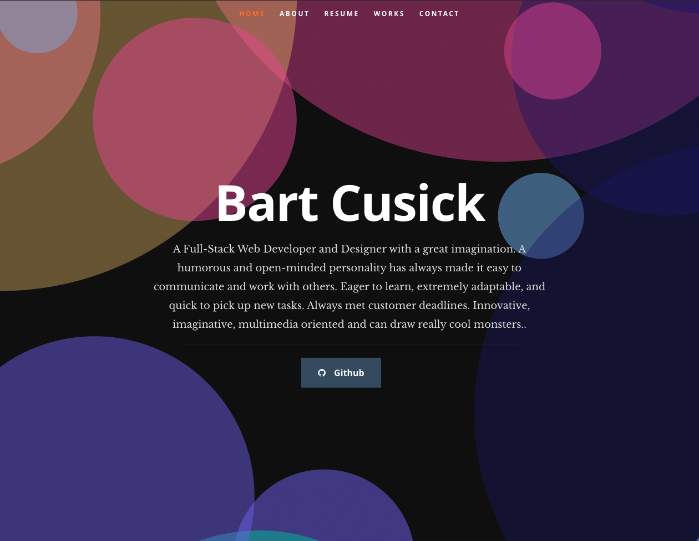
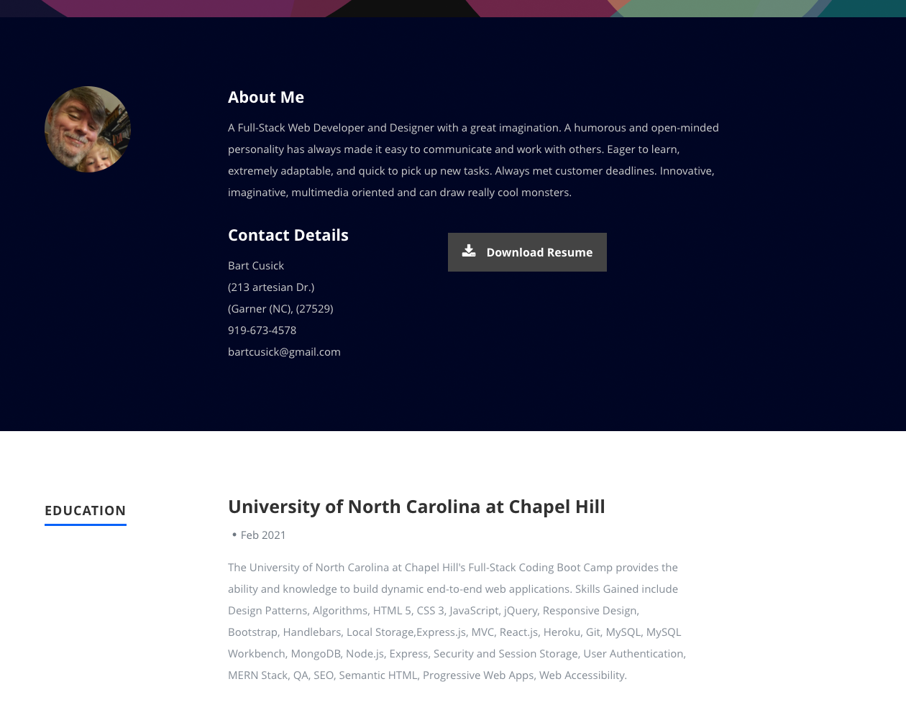

# React Portfolio     

### DEMO is [here](https://cusick-porfolio-react.herokuapp.com/)



## Description
Simple Editing of a React Portfolio.To get to know the React file structure and better understanding of components. IT was also a learning project on deploying to git hub pages. 



## Run Project
### 1. Clone the project

### 2. Run the project
```shell
npm i
npm start
```

### 3. BUild
```shell
npm run build
```
## Description
This project forks from [https://github.com/tbakerx/react-resume-template](https://github.com/tbakerx/react-resume-template), I made some modifications and adjustments, thanks to the [author](https://github.com/tbakerx).
